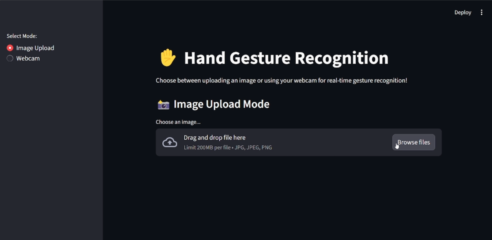

# GTC-Hand-Gesture-Recognition
This project is an AI-based system designed to recognize hand gestures from static images or live video streams. It aims to enable touchless control and enhance applications such as human-computer interaction, gaming, and sign language interpretation.

## ScreenShots


## Features
- Real-time hand gesture recognition via webcam
- Training and evaluation scripts with clear CLI entry points
- Pretrained MobileNetV2 weights included for quick demo
- Results artifacts: confusion matrix and classification report


## 🚀 Quickstart

1- Fork and Clone repo
 - `git clone https://github.com/24-mohamedyehia/GTC-Hand-Gesture-Recognition`

2- 📦 Install Python Using Miniconda
 - Download and install MiniConda from [here](https://www.anaconda.com/docs/getting-started/miniconda/main#quick-command-line-install)

3- Create a new environment using the following command:
```bash
conda create --name Hand-Gesture-Recognition python=3.11 -y
```

4- Activate the environment:
```bash
conda activate Hand-Gesture-Recognition
```

5- Install the required packages
```bash
pip install -r requirements.txt
```

6- Setup the environment variables
```bash
cp .env.example .env
```
## Demo Video
- Watch a sample demo locally: [Hand_Gesture_recognition.mp4](https://github.com/24-mohamedyehia/GTC-Hand-Gesture-Recognition/raw/refs/heads/main/public/Hand_Gesture_recognition.mp4)
- Tip: GitHub may not stream MP4 in-browser. If playback fails, download the file or convert to MP4 for embedding.

## Presentation
  - Canva : [Presentation (Canva)](https://www.canva.com/design/DAG0GoYWolQ/xzrvgT9eK9UnoKCGMwtb1g/edit)
  - Powerpoint : [Presentation (Powerpoint)](./public/Hand-Gesture-Recognition.pptx.pptx)

## Dataset
We used the ASL Alphabet dataset for training and evaluating our hand gesture recognition model.
You can download the dataset from [Kaggle](https://www.kaggle.com/datasets/grassknoted/asl-alphabet)

## Project Structure
```
GTC-Hand-Gesture-Recognition/
│
├── Data/                      # Dataset root (train/val)
│   ├── train/
│   ├── test/
│   └── val/
│
│
├── preprocessing/           # Data cleaning & augmentation scripts
│   ├── dataloader.py
│   ├── transforms.py
│   └── __init__.py
│
├── models/                  # Architectures & model builders
│   ├── mobilenet.py         # MobileNetV2 backbone
│   └── __init__.py
│
├── scripts/                 # Training / Evaluation / Prediction
│   ├── train.py
│   ├── evaluate.py
│   ├── predict_simple.py
│   ├── predict_realtime.py
│   └── split_data.py
├── outputs/                 # Saved results (checkpoints, plots, logs)
│   ├── classification_report.csv
│   ├── confusion_matrix.png
│   └── mobilenetv2_gesture.pth
│
├── utils/                   # Helper functions       
│   ├── __init__.py
│   ├── metrics.py
│   └── train_utils.py
│
├── deployment/              # Apps / serving
│   └── app.py              
│
├── labels.json              # Mapping: class ↔ index
├── requirements.txt         # Python dependencies
├── .env.example        
├── README.md                # Main documentation
└── .gitignore
```
## Technical Stack
 - Python 3.11
 - Pytorch
 - OpenCV
 - streamlit
 - Scikit-learn

## Authors
- [Mohamed Yehia](https://github.com/24-mohamedyehia)
- [Ahmed Ammar](https://github.com/a7med-3mmar)
- [Faris Abouagour](https://github.com/faris-agour)
- [Mohamed Ghoneim](https://github.com/mohamed-aliii)
- [Youssef Fady](https://github.com/Youssefady)

## 📜 License
This project is licensed under the MIT License. See the [LICENSE](./LICENSE) file for details.

## 📝 Acknowledgments
- [ASL Alphabet Dataset](https://www.kaggle.com/datasets/grassknoted/asl-alphabet)
- [GTC](https://www.linkedin.com/company/genius-technology-center/posts/?feedView=all)


